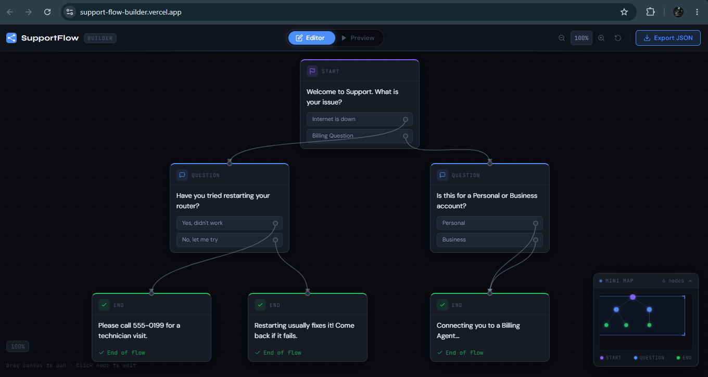
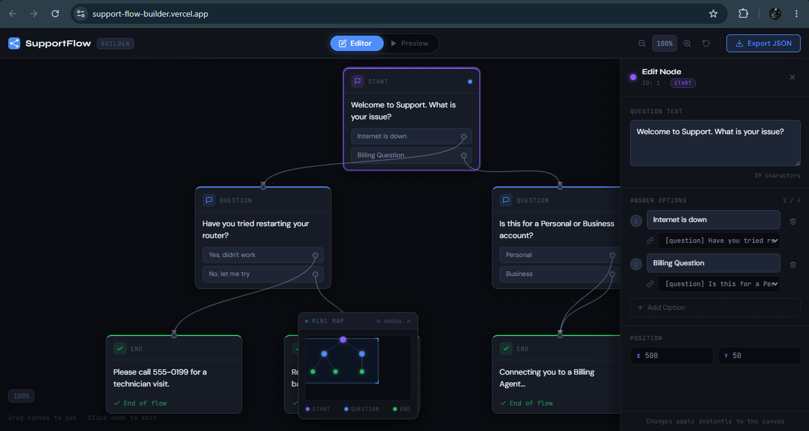
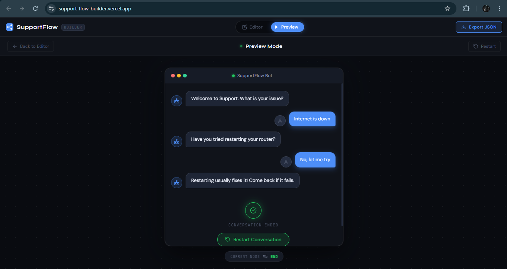

# SupportFlow Builder

A visual decision tree editor for building and testing customer support chatbot flows. Built as a frontend engineering challenge demonstrating custom graph rendering, SVG connector drawing, and real-time state management — without any flowchart or UI component libraries.

## Live Demo
https://support-flow-builder.vercel.app/

## Design File
https://www.figma.com/design/VxDEaWVEUobWEct0blRfpb/SupportFlow-Builder-%E2%80%94-Design-System?node-id=0-1&t=4QCLTBVf6k2Um8DV-1

## live Screens samples 
  

## What It Does

SupportFlow Builder lets support managers visually build, edit, and test automated chatbot conversation flows — replacing messy spreadsheet configurations with an interactive flowchart editor.

**Editor Mode**
- Renders conversation nodes as connected flowchart cards on a pannable, zoomable canvas
- Three node types: Start (purple), Question (blue), End (green)
- SVG bezier curves connect nodes with arrowheads, drawn from live DOM coordinates
- Click any node to open the Edit Panel and modify it in real time
- Drag the canvas background to pan around the workspace
- Zoom in/out with toolbar controls (40% – 200%)

**Edit Panel**
- Slides in from the right when a node is selected
- Edit question text — canvas updates instantly, no save needed
- Add, edit, delete, and relink answer options
- Dropdown to reassign which node each option leads to
- Disappears completely when no node is selected

**Preview Mode**
- Switches the canvas to a chat interface simulating the real bot experience
- Typing indicator before each bot message
- Click answer options to traverse the conversation graph
- Restart button when a leaf node (end of flow) is reached
- Node tracker shows which node is currently active

**Mini Map** *(Wildcard Feature)*
- Live canvas overview rendered on an HTML Canvas element in the bottom-right corner
- Shows all nodes as colored dots with bezier connector lines
- Blue viewport rectangle tracks your current pan and zoom position in real time
- Smoothly shifts left when the Edit Panel opens so it is never covered
- Collapse/expand by clicking the header

**Export**
- Download the current flow state (including any edits) as `flow_data.json`

## Tech Stack

| Layer           | Choice         |
|-----------------|----------------|
| Framework       | React 18 via Vite |
| Styling         | Vanilla CSS with CSS custom properties (no Tailwind, no UI libraries) |
| Graph rendering | Custom SVG bezier curves from live DOM coordinates |
| Mini map        | HTML Canvas 2D API |
| State           | React useState / useCallback (no Redux, no Zustand) |
| Data            | JSON file loaded at startup, edited in memory |

## Architecture
  SupportFlow-Visual-Builder/
  ├── src/
  | ├── assets/
  | ├── Components/
  | | | ├── Canvas/ 
  | | | | ├── Canvas.css
  | | | | ├── Canvas.jsx 
  | | | ├── Connector/
  | | | | ├── Connector.css 
  | | | | ├── Connector.jsx 
  | | | ├── EditPanel/
  | | | | ├── EditPanel.css
  | | | | ├── EditPanel.jsx
  | | | ├── MiniMap/
  | | | | ├── MiniMap.css
  | | | | ├── MiniMap.jsx
  | | | ├── Node/
  | | | | ├── Node.css
  | | | | ├── Node.jsx
  | | | ├── Preview/
  | | | | ├── Preview.css
  | | | | ├── Preview.jsx
  | | | ├── Toolbar/
  | | | | ├── Toolbar.css
  | | | | ├── Toolbar.jsx
  | ├── data/
  | | ├── flow_data.json
  | | | | ├── DetailPage.css
  | | | | ├── DetailPage.js
  | | | | ├── Headling.css
  | | | | ├── Headling.js
  | | | | ├── Search.js
  | | | | ├── Logos.js  
  | ├── App.css
  | ├── App.jsx
  | ├── index.css
  | ├── main.jsx
  ├── .gitignore
  ├── eslint.config.js
  ├── index.html
  ├── LICENSE
  ├── package-lock.json
  ├── package.json
  ├── README.md
  ├── vite.config.js
   
**State lives entirely in `App.jsx`** and flows down as props. All node edits are in-memory — no backend, no localStorage. The `nodes` array is the single source of truth shared across the canvas, edit panel, preview, and minimap.

---

## How the SVG Connectors Work

This is the core Computer Science challenge of the project. No library draws the lines.

1. After every render, each node's output dots and input dots are queried from the DOM using `data-*` attributes
2. `getBoundingClientRect()` reads their real screen positions
3. Coordinates are converted from screen-space to content-space by dividing by the current zoom level
4. Cubic bezier paths are calculated between each output→input pair
5. Paths are rendered as SVG `<path>` elements with `<marker>` arrowheads
6. This recalculates on every node change, pan, and zoom so lines always track their nodes


## Wildcard Feature — Mini Map

**Why this feature:** On real support flows with 20+ nodes, managers lose their place constantly. The mini map solves spatial disorientation — at a glance you can see the full conversation architecture, where you currently are in the canvas, and navigate mentally without zooming out. This makes the editor genuinely usable for production-scale flows, not just demos.

**How it works:** An HTML Canvas element redraws on every pan, zoom, and node change. Node positions are scaled from canvas-space (1400×900) to minimap-space (180×110). The blue viewport rectangle is calculated from the current pan offset and zoom level, showing exactly what portion of the canvas is visible.


## Getting Started

**Prerequisites:** Node.js 18+

```bash
# Clone the repo
git clone https://github.com/Code-Mole/SupportFlow-Builder.git

cd SupportFlow-Builder

# Install dependencies
npm install

# Start development server
npm run dev

# Build for production
npm run build

# Preview production build
npm run preview
```

Open `http://localhost:5173` in your browser.


## The Flow Data Format

The app reads from `src/data/flow_data.json`. You can export your edited version at any time using the Export JSON button in the toolbar.

```json
{
  "nodes": [
    {
      "id": "1",
      "type": "start",
      "text": "Welcome to Support. What is your issue?",
      "position": { "x": 500, "y": 50 },
      "options": [
        { "label": "Internet is down", "nextId": "2" },
        { "label": "Billing Question", "nextId": "3" }
      ]
    },
    {
      "id": "2",
      "type": "question",
      "text": "Have you tried restarting your router?",
      "position": { "x": 250, "y": 280 },
      "options": [
        { "label": "Yes, didn't work", "nextId": "4" },
        { "label": "No, let me try", "nextId": "5" }
      ]
    },
    {
      "id": "3",
      "type": "end",
      "text": "Connecting you to a Billing Agent...",
      "position": { "x": 750, "y": 280 },
      "options": []
    }
  ]
}
```

**Node types:**
- `start` — entry point of the conversation, exactly one per flow
- `question` — presents the user with answer options that link to other nodes
- `end` — leaf node, terminates a conversation branch


## Constraints Met

- No flowchart libraries (`react-flow`, `jsPlumb`, `mermaid.js`) — SVG drawing is fully custom
- No UI component libraries (Bootstrap, Material UI, Chakra UI) — all components hand-built
- No backend — all state is managed in React memory
- Separate CSS files per component — no inline style objects for layout
- Vite + React — as specified

## Submission Checklist

 [x] Public GitHub repository
 [x] Commit history shows incremental progress
 [x] Live deployment tested in incognito window
 [x] No restricted libraries used
 [x] Design file linked and set to public view
 [x] README replaced with project documentation


## Author

 Emmanuel Asanga Atiah
 codemole46@gmail.com 
 GitHub: https://github.com/Code-Mole